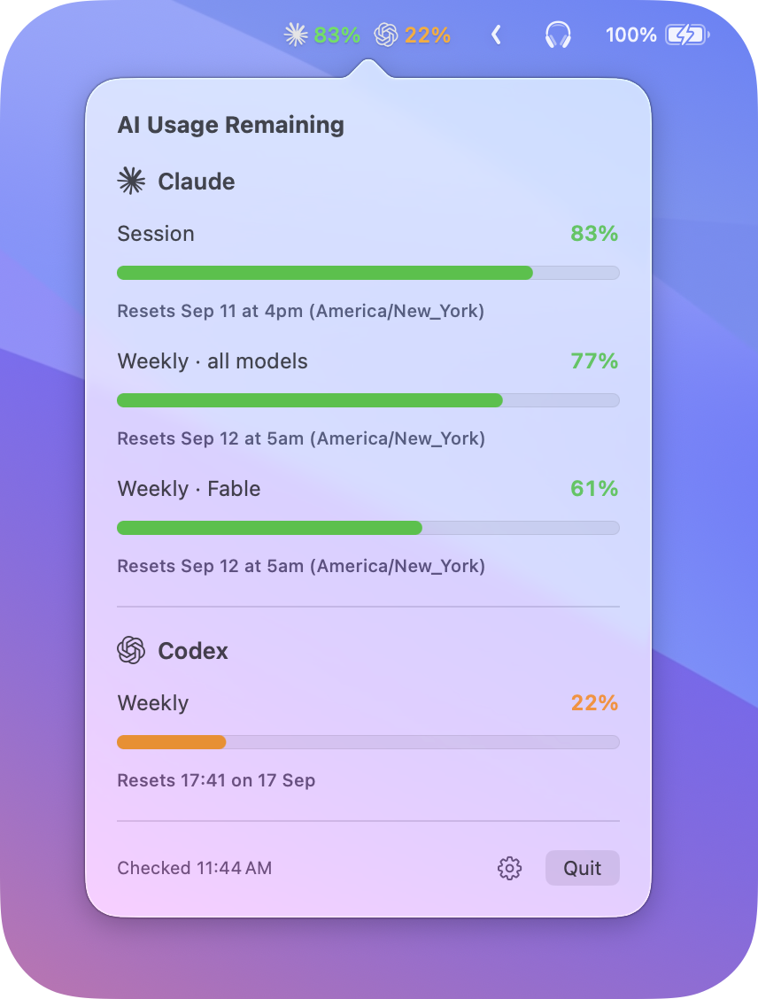

# AI Usage

A native macOS menu bar app showing Claude and Codex usage beside their logos. Click it for Claude session, Claude weekly, Claude Fable weekly, and Codex weekly allowances, including reset times. Percentages mean **remaining**. Readings come from the signed-in `claude` and `codex` CLIs on your shell's `PATH`.



Open the settings gear and choose **Stacked** to show Claude above Codex in the menu bar. **Basic** keeps them side by side and is the default. Your choice is saved between launches.

## Install

```sh
brew install --cask tuckerritti/tap/ai-usage
```

Updates arrive with `brew upgrade`.

## Build and run

Requires macOS 14 or newer and Xcode.

```sh
./run.sh
```

This builds and launches `build/Build/Products/Release/AI Usage.app`. Quit an existing instance before rebuilding.

See [ATTRIBUTIONS.md](ATTRIBUTIONS.md) for logo sources.

## Release

Every push to `main` releases its tip commit after checks pass. The Release workflow creates the next patch tag, such as `v1.0.2` after `v1.0.1`, signs and notarizes the app, publishes its DMG, and updates [the Homebrew tap](https://github.com/tuckerritti/homebrew-tap).

The app version comes from the tag and its build number comes from the GitHub Actions run number. No Xcode version edits or manual tagging are needed. Releases queue and run one at a time; retrying a failed run reuses its tag and build number unless a newer commit has already been tagged. Existing releases are never overwritten.

Once the workflow succeeds, quit AI Usage and run:

```sh
brew update
brew upgrade --cask tuckerritti/tap/ai-usage
```

To sync the tap with the latest published release without building again:

```sh
gh workflow run release.yml --ref main
```

The tap checkout uses the `HOMEBREW_TAP_SSH_KEY` Actions secret and a write-enabled deploy key restricted to the tap repository.
